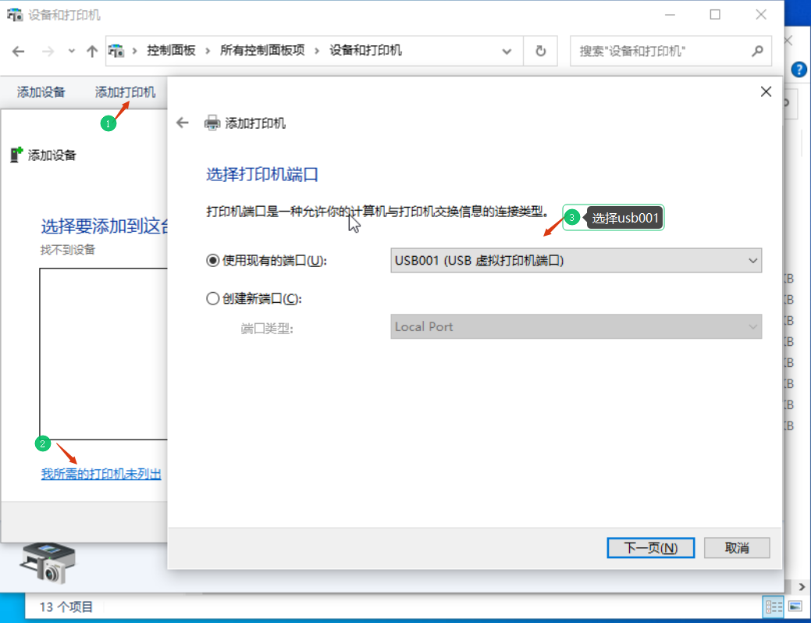
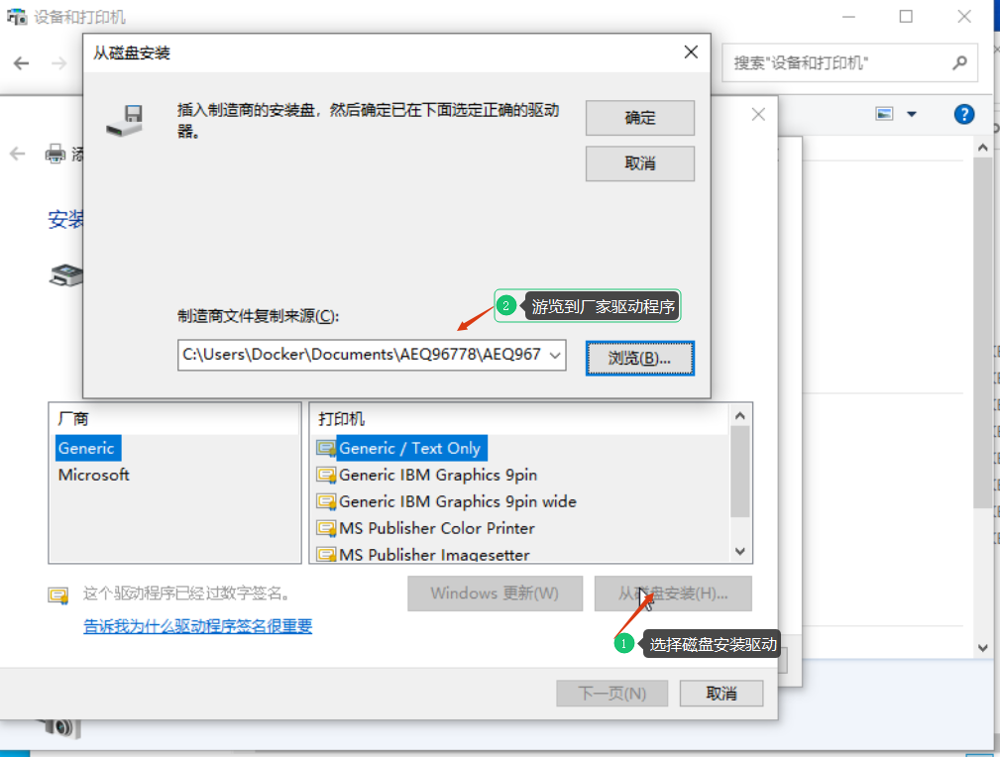

## 查看usb信息

```
root@fnnas:~# lsusb
Bus 002 Device 002: ID 8087:0024 Intel Corp. Integrated Rate Matching Hub
Bus 002 Device 001: ID 1d6b:0002 Linux Foundation 2.0 root hub
Bus 001 Device 003: ID 1bcf:2c18 Sunplus Innovation Technology Inc. HD WebCam
Bus 001 Device 002: ID 8087:0024 Intel Corp. Integrated Rate Matching Hub
Bus 001 Device 001: ID 1d6b:0002 Linux Foundation 2.0 root hub
Bus 004 Device 001: ID 1d6b:0003 Linux Foundation 3.0 root hub
Bus 003 Device 002: ID 232b:0f13 Pantum Ltd. AEQ96778 series                  <-- 打印机ID，前面是厂家ID,后面是产品ID
Bus 003 Device 001: ID 1d6b:0002 Linux Foundation 2.0 root hub
```

## 配置windows ltsc10 虚拟机

```
services:
  windows:
    image: dockurr/windows                                                # https://github.com/dockur/windows
    container_name: windows
    environment:
      VERSION: "ltsc10"                                                   # 系统标识
      RAM_SIZE: "2G"                                                      # 分配的内存
      CPU_CORES: "2"                                                      # 分配的核心
      DISK_SIZE: "20G"                                                    # 分配储存空间
      LANGUAGE: "Chinese"
      ARGUMENTS: "-device usb-host,vendorid=0x232b,productid=0x0f13"      # 调整和上面lsusb输出一致，加0x表示为十六进制
    devices:
      - /dev/kvm
      - /dev/bus/usb                                                      # 调用usb到容器
    cap_add:
      - NET_ADMIN
    ports:
      - 8007:8006                                                         # 和飞牛相册端口冲突
      - 3389:3389/tcp
      - 3389:3389/udp
    stop_grace_period: 2m
    volumes:
      - win10:/storage
      - /vol2/1000/os/windows_10_ltsc_2021_x64.iso:/custom.iso
volumes:
  win10:
```
## 启动虚拟机安装驱动
先通过飞牛nas把打印机驱动和[钉钉打印程序](https://page.dingtalk.com/wow/dingtalk/act/ding-print-pc)复制到虚拟机

### 安装驱动程序
#### 选择usb接口


#### 选择从磁盘安装


### 安装钉钉云打印程序


